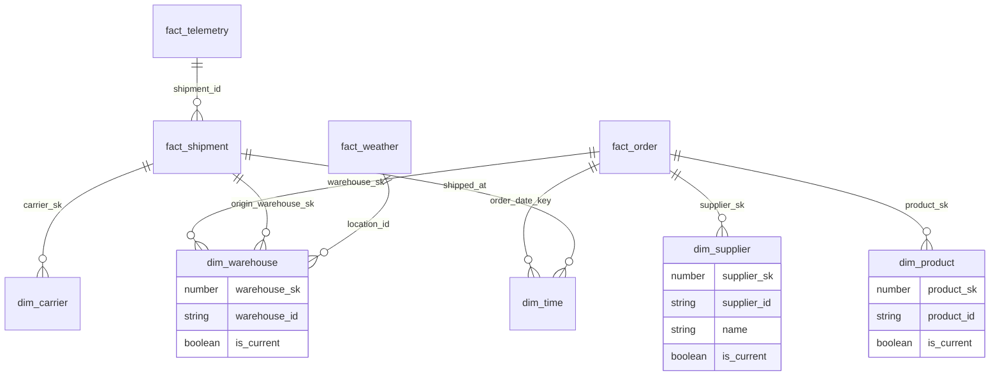

# Supply Chain DW Architecture

## Star Schema (Kimball)

## Data Quality Gates
Between every pipeline stage, a DQ gate verifies:
- Row counts ratio between input/output (alert if < 0.95 or > 1.05)
- Null rate per critical column < 1%
- Surrogate key resolution rate = 100% (no orphan dims)

## Operational SLAs
| Metric | Target |
|--------|--------|
| Pipeline latency | < 30 min for incremental loads |
| OTIF refresh | T+1 day |
| IoT alert latency | < 5 min |
